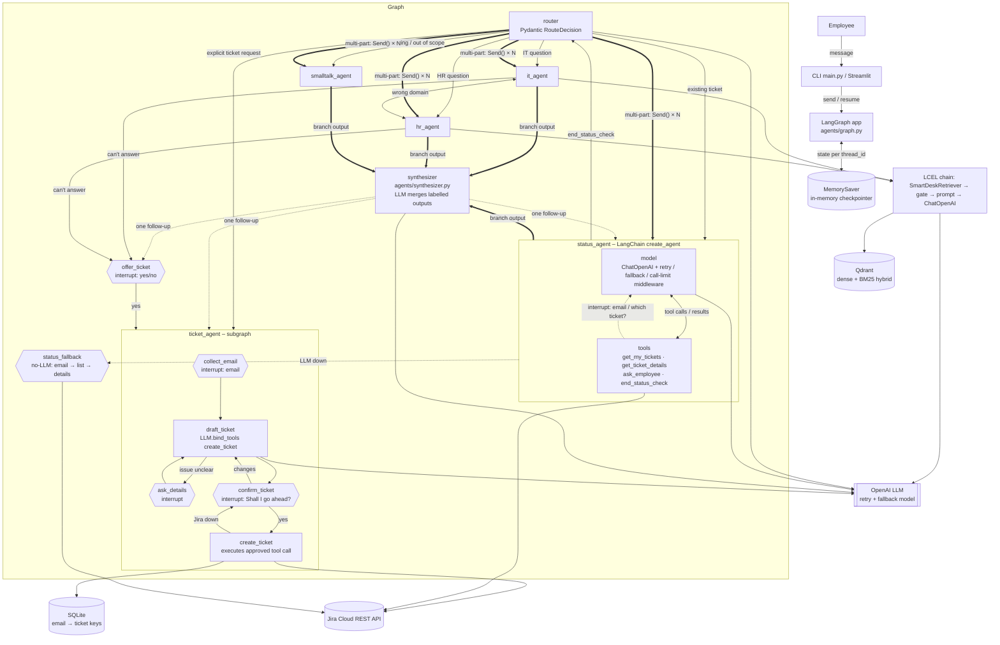
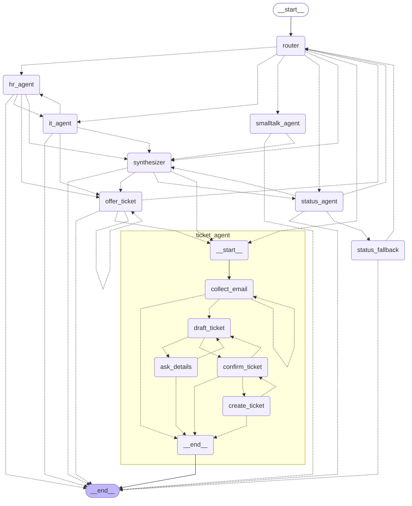

# SmartDesk AI – Architecture

## Components and data flow

Hexagons and dotted "interrupt" arrows are human-in-the-loop points: the graph pauses with `interrupt()` and resumes
with `Command(resume=<employee reply>)`. In the status agent the pauses happen inside the tools. Privacy: the tools
read the verified email via `InjectedState` (hidden from the LLM) and check ticket ownership in code.

## LangGraph graph (generated)
Generated from the compiled graph with the ticket subgraph expanded (`xray=True`):
`python -c "from agents.graph import build_graph; print(build_graph().get_graph(xray=True).draw_mermaid())"`.
Dotted edges are `Command(goto=...)` transitions chosen inside the node.

The status agent is invoked inside the `status_agent` node, so its internal model ⇄ tools loop isn't expanded here.

